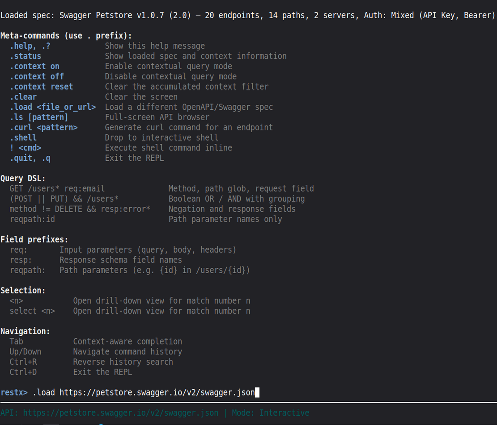
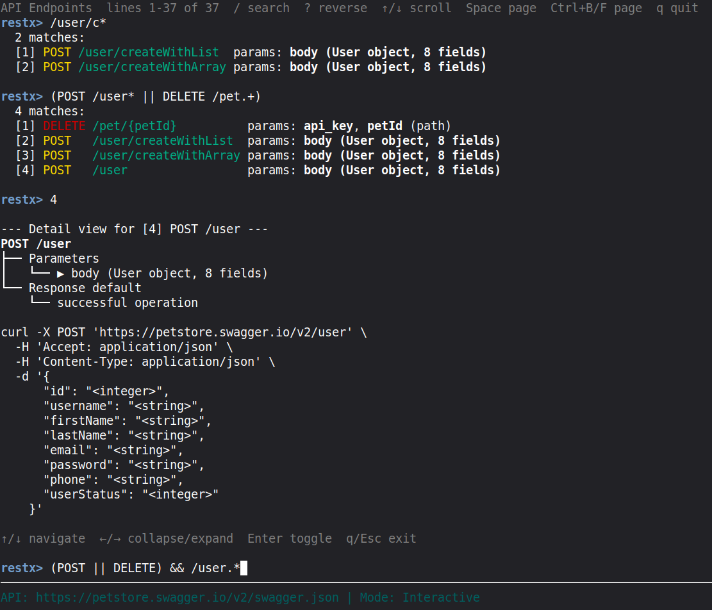

# RestX

> An interactive CLI for exploring REST APIs via OpenAPI/Swagger specs - built using a rigorous AI-assisted workflow.

**Status:** v0.9.0-alpha - Functional, but expect rough edges. Core features largely working but still being developed.

## What It Does

RestX lets you load any OpenAPI or Swagger spec and explore it from the terminal:

- **Custom DSL:** Query endpoints by method, path, tags, or free text (`GET /users`, `req:auth`, `POST AND pet`)
- **curl Generation:** Generate ready-to-run curl commands for any endpoint
- **REPL with Shell Access:** Run shell commands inline with `!` or drop to a full shell

## Tech Stack

Python · rich · prompt_toolkit · PyYAML · requests

## Installation

```bash
pip install -r requirements.txt
python restx.py --help
```
## Screenshots

<div align="center">

### CLI Help Output


### Command Execution


</div>

## AI-Assisted Workflow
This project was built using a decoupled AI workflow based on Matt Pocock's methodology, adapted for a Lumo + Cursor toolchain:

Planning: Architecture, DSL design, and PRDs defined in dedicated sessions - no coding until alignment is reached.
Implementation (Cursor): Code generated in isolated vertical slices (one feature per fresh context) to stay within the "Smart Zone" (~100k tokens) and prevent context decay.
Human Oversight: All code reviewed, tested, and manually committed. AI is the implementation engine, the human is the architect.
See skills/ for the prompt templates used to enforce this workflow.

Security & Trust Model
RestX is a local development tool with intentional shell integration.

Trust Boundary: The user at the REPL is assumed to be trusted. Commands via ! or the interactive shell execute with full permissions of the current user.
Warning: Do not use RestX in untrusted environments or with elevated privileges.

#### Disclaimer
This software is provided "as is" without warranty of any kind. The author assumes no liability for any damages or other issues arising from the use of this code. 

#### License
MIT - see LICENSE for full text.

#### Contact  
https://github.com/cruxcoder | cruxcoder [at] proton [dot] me  
